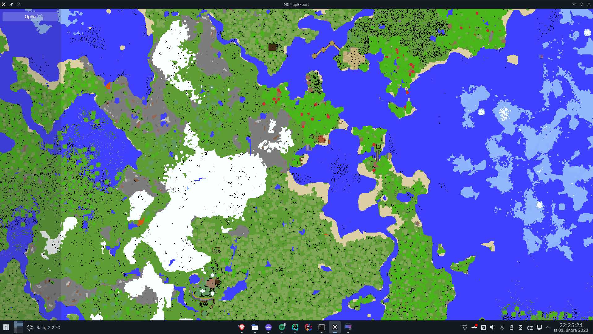
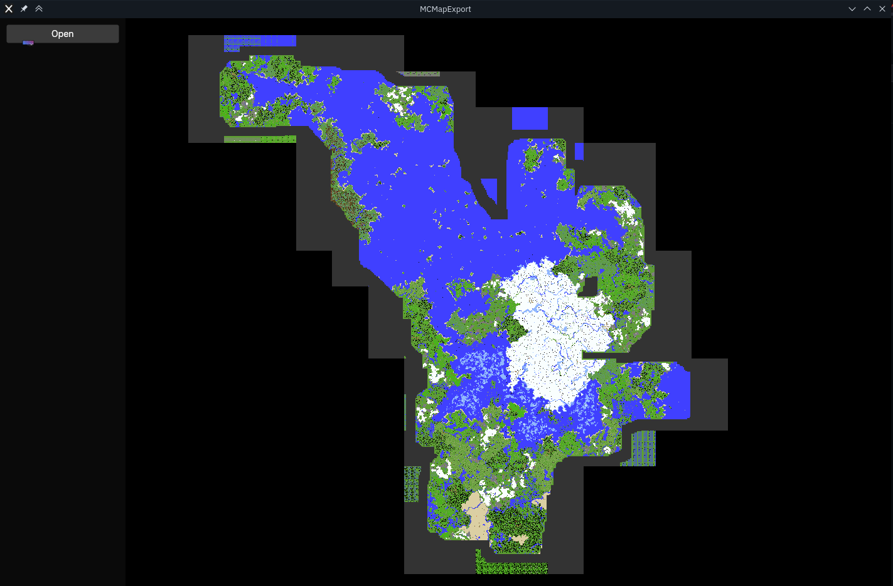

# MCMapExport
A utility to display most Minecraft (tested only on 1.17) maps by parsing the save files and displaying them using OpenGL. The map are parsed and sent out to rendere using C# with .NET 5. UI is made using AvaloniaUI for that sweet cross platform support.

### Screenshots

